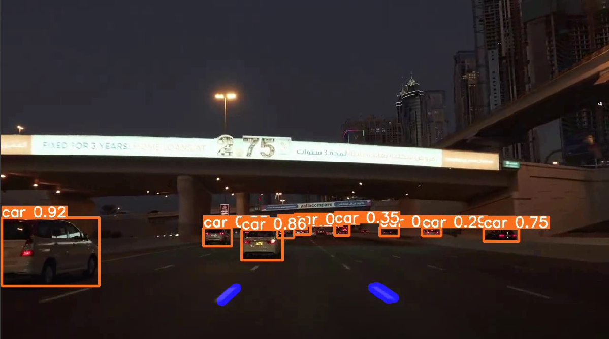

># Realtime-Lane-detection-and-Object-detection

# Requirements:

* Python version 3 or above (with pip, matplotlib, numpy, seaborn)
* PyTorch
* OpenCV Library for python package
* Recommended CUDA with CUDNN (For Nvidia GPU Processing)
* Yolo Version 5 Repository with yolov5s.pt model (required files are included in this repository itself) 

# To Run (Tested on Anacoda3):

1. Clone this repository
2. Get a New Terminal from the current location
3. Type "python3 lane.py & python3 yolov5/detect.py --source v2.mp4 --view-img"

# Result:

# Reference:

1.https://github.com/Nirmal-C/Real-Time-Lane-Detection
2.https://github.com/nicedaddy/Yolov5_DeepSort_Pytorch_lane_detection

